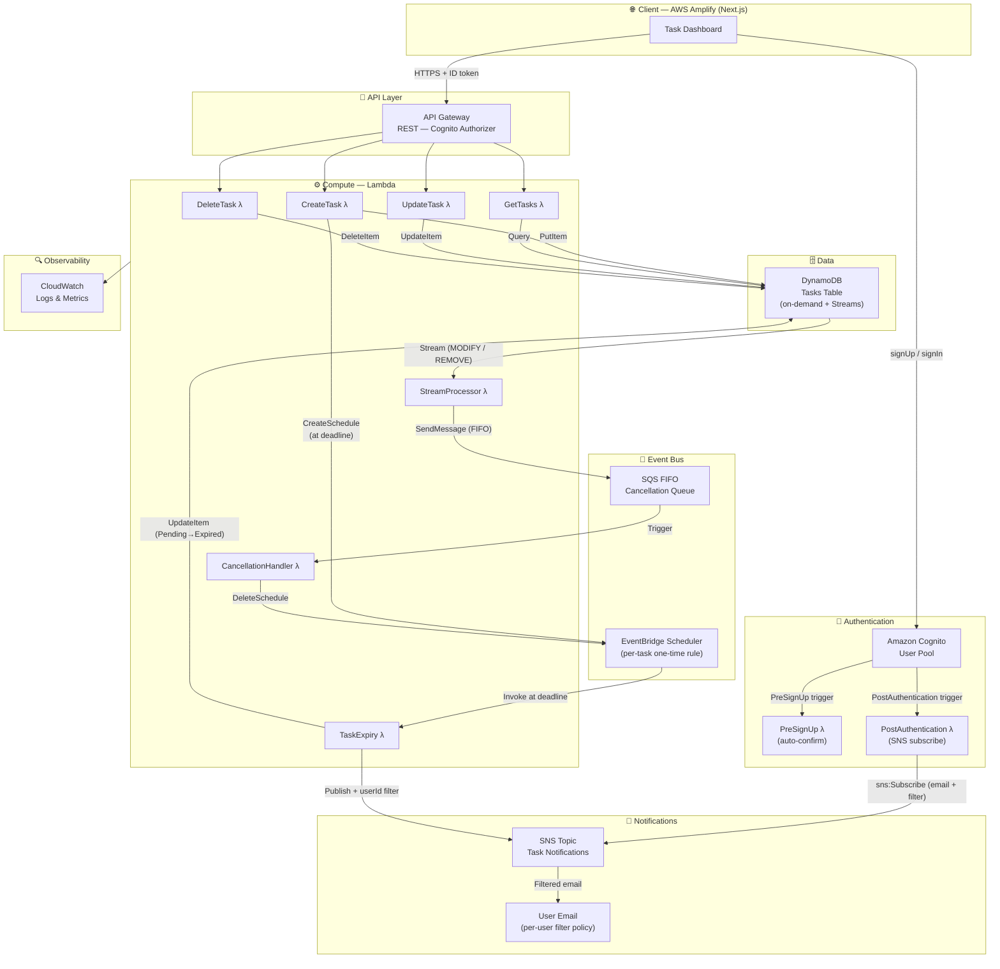
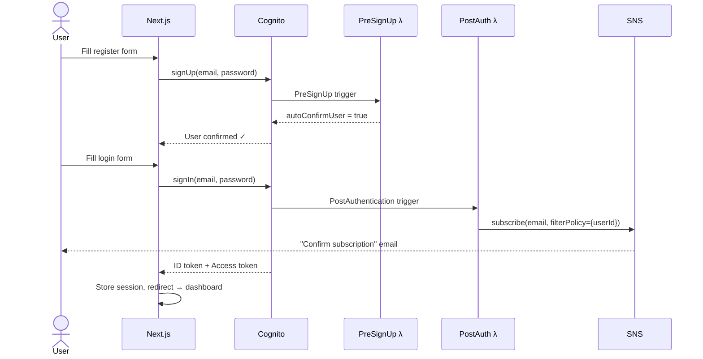
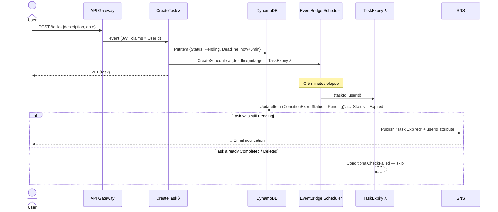
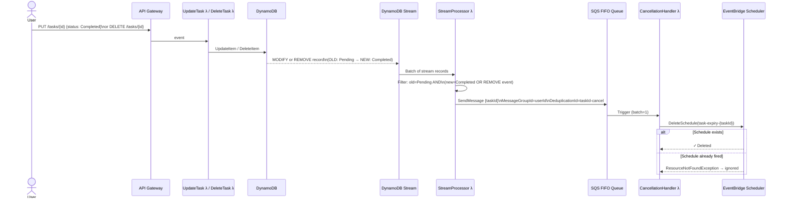
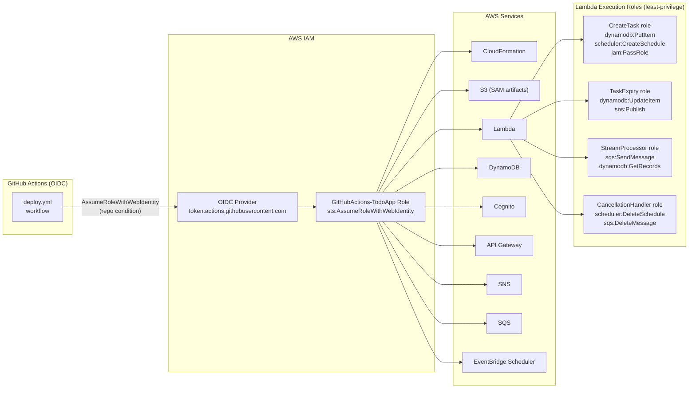

# Architecture Diagram

> All diagrams are written in [Mermaid](https://mermaid.js.org/) and render natively on GitHub.

---

## 1. High-Level System Overview



---

## 2. User Authentication Flow



---

## 3. Task Creation & Expiry Flow



---

## 4. Expiry Cancellation Flow (DynamoDB Streams → SQS FIFO → Lambda)



---

## 5. IAM Trust & Permissions Model



---

## 6. Data Model

```mermaid
erDiagram
    TASKS {
        string UserId PK "Cognito sub (partition key)"
        string TaskId SK "UUID (sort key)"
        string Description "Task text"
        string Date "YYYY-MM-DD"
        string Status "Pending | Completed | Expired"
        string Deadline "ISO-8601 — now + 5 min"
        string CreatedAt "ISO-8601"
        string UpdatedAt "ISO-8601"
        string UserEmail "Owner email (denormalised)"
    }
```

**Access patterns supported by the primary key:**

| Pattern | Operation |
|---|---|
| List all tasks for a user | `Query(UserId = :uid)` |
| Get / update / delete one task | `GetItem / UpdateItem / DeleteItem(UserId, TaskId)` |
| Expiry handler writes | `UpdateItem(UserId, TaskId)` with condition `Status = Pending` |
